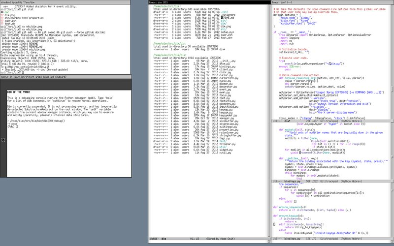

# DIM OF THE YARD!

Dim is a pure-Python window manager for the X window system written
by [Alex Plotnick](mailto:shrike@netaxs.com). It currently runs under
Python 2.6 or 2.7, and uses [xpyb](http://cgit.freedesktop.org/xcb/xpyb/)
(the Python [XCB](http://xcb.freedesktop.org/) bindings) to communicate
with the X server. It was designed to be:
* Correct (especially with regard to sloppy focus)
* Simple
* Extensible
* Unobtrusive

It was not designed to support desktop environments or eye candy.



## Installation

To use Dim, you'll first need to install xpyb; packages are available
for all major Unix-like systems. Once you've got that, you can download
Dim and try running it directly from the source directory. First run
```./setup.py generate_py``` to auto-generate a few modules from the
Xlib C headers (if those aren't in any of the usual places, you can use
the `--source-dirs` option to tell the setup script where to find them),
then run ```./bin/dim``` to start it up. If you decide you like it,
you can install it via ```./setup.py install```.

## Usage

The main script `bin/dim` takes a variety of options that control various
aspects of its behavior; `--help` gives a summary. For example, the default
focus mode is sloppy focus (i.e., focus-follows-mouse except for the root
window), but if you prefer click-to-focus (like Windows or Mac OS), you can
use the `--focus-mode=click` option. If you don't like the standard `fixed`
font for your window titles, you can provide an XLFD font name with the
`--title-font` option (Dim currently supports only core X fonts, so don't
give it an Xft-style name). Dim can also be asked to exit, restart itself,
invoke another window manager, or switch [tagsets](#tagsets) from the
command line; see Control Options in the help message.

### Moving & Resizing Windows

While Dim is running, it decorates visible windows with a titlebar and a
thin border. You can move a window around by clicking and dragging on the
titlebar, or by holding down the `Alt` key and clicking anywhere in the window.
If you hold down `Alt` and right-click (i.e., press button `3`) in a window,
you can resize the window; where you initially click in the window
determines which side or corner is adjusted during the resize, but you can
use the space bar to switch between modes. Pressing escape during a resize
or move aborts the operation and returns the window to its original size
and position. Other windows and the screen edges (and CRTC edges, if the
`RandR` extension is enabled) offer resistance to window movement and
resizing. Notice also that guide lines appear along with resistance due
to adjacent window edges; this helps you easily line up windows.

A set of window maximization shortcuts is also defined. By default, the
bindings use the prefix `Control-Alt-=`, followed by `Return` to toggle
fullscreen mode (no titlebar or other decorations), `Left` or `Right` to
maximize horizontally, `Up` or `Down` to maximize vertically, `Space` to
toggle maximization, and `-` to unmaximize. The example user-customization
file includes further bindings for multitouch gestures (e.g., swipe down
to maximize vertically, left for horizontally, &c.); see
[Customization](#customization) below.

### Tagsets

One of Dim's distinguishing features is its use of *tagsets* instead of
traditional virtual desktops. Each window managed by Dim may *tagged*
with any number of tags (non-whitespace-containing strings), and windows
that share a tag are implicitly grouped into a *tagset*. A small but
powerful tagset specification language allows you to select which windows
are visible.

To tag a window, middle-click (i.e., press button `2`) in the titlebar.
The title will be replaced with a `Tags:` prompt; enter a space-separated
list of tag names, followed by return to commit, or escape to abort.
(A small set of Emacs-like keybindings is supported in this and the other
text entry fields discussed below.)

To switch between tagsets, press `Control-Alt-Tab`, and type a tagset
specification into the minibuffer that appears. (You can also switch
tagsets using the `dim` script with the `-t` option.) If you gave each
window exactly one tag and simply switched between those tagsets,
you'd have a scheme very similar to most implementations of virtual desktops.
But tagsets are more general than virtual desktops, because (a) windows
can have more than one tag, and (b) tagset specifications can include
arbitrary set operations over tagsets. The tagset specification language
is a very small infix language where alphanumeric strings represent tagsets,
and the operators `|`, `\`, `&`, and `~` represent set union, difference,
intersection, and complement, respectively (in increasing order of
precedence). Parenthesis may be used to group sub-expressions, and
whitespace may be used to separate tokens, but is otherwise ignored.
Thus, a tagset specification of `(work \ docs) | mail` says to display
all of the windows tagged `work` except those also tagged `docs`, along
with any windows tagged `mail`. The special tag `.` represents the set of
windows currently visible, so if you followed the last example with `.\mail`,
you'd get everything currently visible except your mail window. The special
tag `*` means all tags, and `0` represents the empty set, i.e., the set of
no windows. (`*` and `~0` are not, in general, equivalent, because the latter
includes windows with no tags, whereas the former does not.) If you tag
a window as `*`, it will implicitly become a part of every tagset, thus
becoming "sticky".

### Launching External Programs

Pressing `Control-Alt-space` prompts you for a command line to execute
using `/bin/sh`. At present, no output from such commands is displayed,
so this should only be used for launching X clients or commands with
side-effects.

## Customization

Dim is designed to be customized & extended with Python code. This has the
disadvantage of requiring a certain level of skill and an understanding of
some (maybe too much) of its internals, but is much more flexible than a
static configuration language. The code is highly modular, and should be
reasonably easy to understand given a solid grounding in [protocol-level X]
(http://www.x.org/releases/X11R7.6/doc/xproto/x11protocol.html) programming
and the [ICCCM]
(http://www.x.org/releases/X11R7.6/doc/xorg-docs/specs/ICCCM/icccm.html).

The modules in the `dim` package define the core window manager functionality,
but many important user-facing variables and classes are defined in the main
script `bin/dim`, so that's a good place to begin customizing Dim's behavior.
For instance, all of the key & mouse button bindings described in this
document are merely defaults established by the global bindings dictionaries
defined therein. A simple but reasonably powerful bindings language is used
for those definitions, expressed as Python dictionaries; see `dim/bindings.py`
for details.

You can modify `bin/dim`, but may prefer not to. To support customization
on a per-user basis, it loads the contents of the file `~/.dim.py`, which
on the author's system is a link to the sample `etc/user-dim.py`. In that
script you will find several examples of the kinds of customizations that
are easy with Dim: augmentation & overriding of button and key bindings,
launching pre-specified commands, changing fonts & colors, pre-defining
tagsets, customizing client decorations, &c. More complex customizations
or extensions generally require adding or modifying modules in the `dim`
package.

## Debugging

Pressing `Break` (i.e., `Control-Pause`) while Dim is running brings up a
debugging console (an xterm in slave mode) with the Python debugger (PDB)
attached to the window manager process. In the (unlikely) event of a crash,
an emergency debugging console will be launched automatically; the exception
that caused the crash may thus be examined and the window manager restarted
without disrupting running clients.

Dim also has extensive support for logging. Running `bin/dim` with the `-v`
option causes it to output informational messages:
```
INFO: wm: Spawning command: ['/usr/local/bin/zsh', '-i', '-c', 'xterm'].
INFO: manager: Shutting down.
INFO: manager: Executing command /home/alex/src/dim/bin/dim --verbose.
```
The `-d` option enables full debugging output:
```
INFO: manager: Executing command dim -d.
DEBUG: wm: Using sloppy focus policy.
DEBUG: manager: Screen geometry: 640x480+0+0.
DEBUG: randr: Using RANDR extension for multi-head support.
DEBUG: randr: CRTC geometries: {0x5e: 640x480+0+0}.
DEBUG: manager: Registering event handler for window 0x54.
DEBUG: tags: Tagset stack: [set([])].
DEBUG: tags: Tagset stack: [set([])].
DEBUG: manager: Adopting window 0x400003.
DEBUG: manager: Managing client window 0x400003.
DEBUG: properties.0x400003: Requesting property WM_CLASS (STRING).
DEBUG: properties.0x400003: Requesting property _NET_WM_STATE (ATOM).
DEBUG: properties.0x400003: Requesting property WM_NORMAL_HINTS (WM_SIZE_HINTS).
DEBUG: client.0x400003: Creating frame 0x60001c.
DEBUG: manager: Registering event handler for window 0x400003.
DEBUG: manager: Registering event handler for window 0x60001c.
DEBUG: properties.0x400003: Requesting property WM_TRANSIENT_FOR (WINDOW).
DEBUG: properties.0x400003: Requesting property _DIM_TAGS (ATOM).
```
The `-l` option can be used to enable logging for specific modules; e.g.,
if you're tracking down a focus issue (after alerting the author, who takes
such bugs *very* seriously) you might not care about property updates.

## Future Work

Dim is still missing many features that some may consider important, such
as full EWMH support, colormap handling (does anyone actually care anymore?),
tiling support, compositing, and non-code-based configuration. There are
surely still many bugs lurking, and certainly bits of the code that could
be cleaner. Perhaps most importantly, this document is currently the closest
thing to an end-user manual. If you would like to help out on any of these
fronts, please feel free to contact the author. Other comments, questions,
complaints, praises, and suggestions are also welcome.
